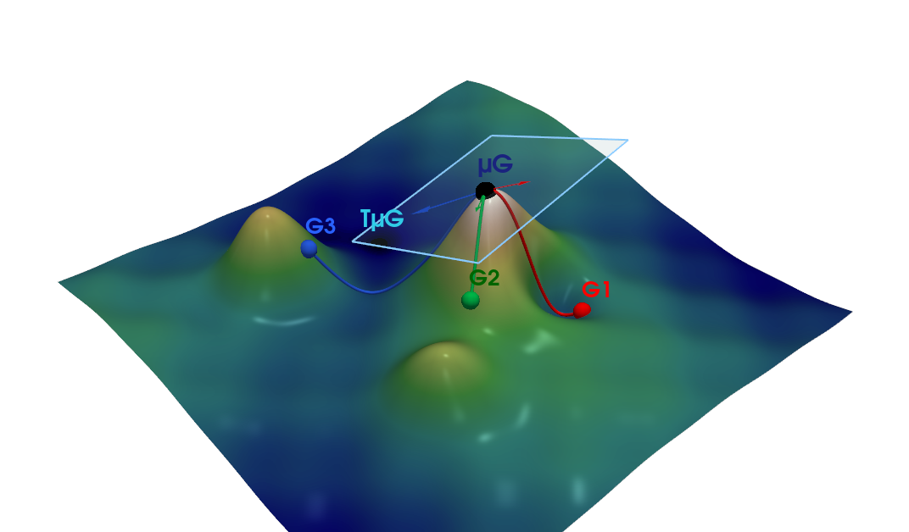
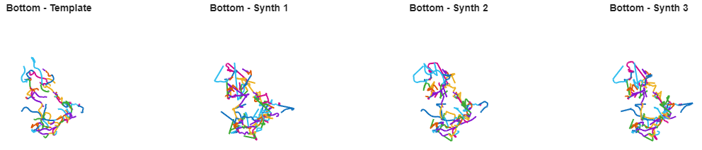
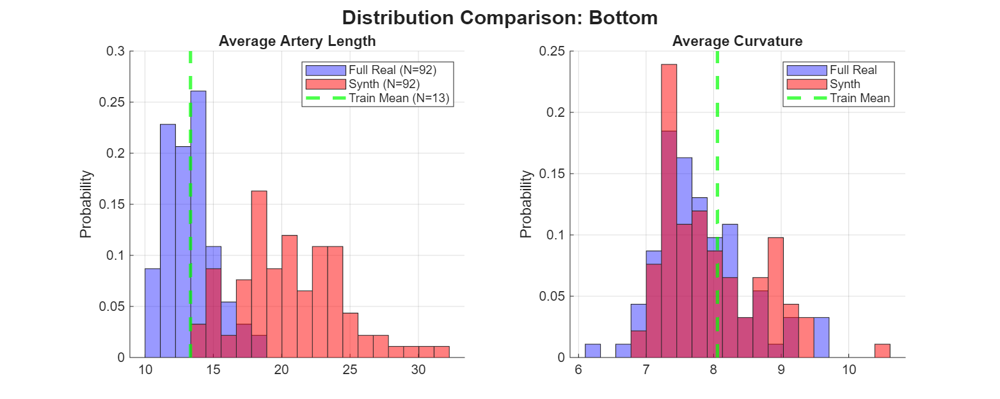

# Statistical Shape Analysis of Brain Arterial Networks: Generative Extension

**Attribution:** This repository is a research extension of the official implementation [statistical-shape-analysis-of-elastic-graphs](https://github.com/xiaoyangstat/statistical-shape-analysis-of-elastic-graphs) by **Xiaoyang Guo et al.** While the core SRVF framework relies on their codebase, this project introduces a **Generative Model** (Tangent Covariance Analysis) and **Geodesic Shooting** modules developed for the Geometric Data Analysis course (MVA).

**Context:** MVA Master's Project (ENS Paris-Saclay)

**Keywords:** Riemannian Geometry, Elastic Shape Analysis, SRVF, Tangent PCA, Geodesic Shooting.

## Abstract

This project implements a rigorous framework for the statistical analysis of Brain Arterial Networks (BANs). We model BANs as **elastic graphs** within a Riemannian quotient space:
$$\mathcal{G} = \mathcal{B} / (\mathcal{P} \times SO(3))$$
This structure ensures invariance to re-parameterization, rigid motion, and node permutation.

**Key Contribution:** Beyond descriptive statistics, we introduce a **generative model** exploiting the local linearity of the tangent space at the Fréchet mean. By sampling from a multivariate Gaussian distribution on the tangent bundle and performing **geodesic shooting** (Exponential Map), we synthesize plausible arterial networks to address the "Small Data" problem in medical imaging.

## Methodology: Generative Geodesic Shooting

To understand the generative process, we visualize the tangent space $T_{\mu}\mathcal{G}$ and the exponential map shooting. The generation follows a 3-step pipeline:
1.  **Log-Map:** Project real graphs onto the tangent space of the Fréchet Mean.
2.  **Tangent PCA:** Estimate the covariance structure of the population.
3.  **Exp-Map:** Sample latent vectors and shoot them back to the manifold.

## Results & Quantitative Validation

We validated the generative model by comparing the distribution of geometric features between real data ($N=92$) and synthetic samples generated from a small training set ($N=13$).

### 1. Visual Plausibility
The model captures component-specific geometric features (curvature, scale, tortuosity) while maintaining topological constraints.

### 2. Statistical Analysis
We performed a quantitative assessment of the generated shapes:

* **Curvature (Right):** The model perfectly fits the curvature distribution of real patients. This validates that the **SRVF metric** successfully captures the intrinsic local geometry of the vessels.
* **Length (Left):** We identify a topological bias (length mismatch) due to the fixed-template constraint. The matching process induces elastic tension to satisfy node connectivity, highlighting the need for future **topological relaxation** or Optimal Transport approaches.

## Usage & Data

To replicate the generative process, simply run the script `generate_synthetic_BAN.m` in Matlab. The necessary dataset samples are located in the following link : [here](https://www.dropbox.com/scl/fi/3asomibs2lkos15t3xk38/BAN.zip?rlkey=h9qjifhdveeaqnt43rp0mpnl2&e=1&dl=0)

## References

* **[1]** Guo, X., et al. (2020). "Statistical Shape Analysis of Brain Arterial Networks (BAN)". *Annals of Applied Statistics*.
* **[2]** Srivastava, A., & Klassen, E. P. (2016). *Functional and Shape Data Analysis*. Springer.